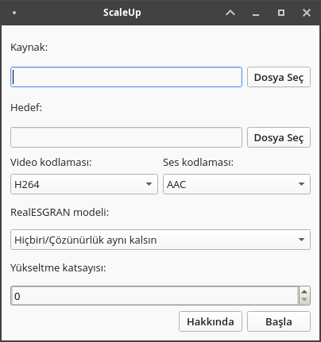

# ScaleUp

ScaleUp, is a software that uses the RealESRGAN artificial intelligence to enhance the resolution of videos, making them higher quality.

NOTE: You need to have a gpu supports Vulkan for using this app.

<div align="center">



</div>

## Installation

### Installing with pip

You can run following command for installing ScaleUp:

```
pip install ScaleUp
```

After installing you can run ScaleUp with `python -m ScaleUp`

### Installing from releases page

If you want to use prebuilt packages you can download from Releases page.

### Packing

If you want to pack ScaleUp, you need to install requirements and PyInstaller first:

```
pip install -r requirements.txt
pip install pyinstaller
```

After that, you need to build ScaleUp with the command specified below:

```
python setup.py build
```

Finally, you can build the package with:

```
pyinstaller ScaleUpApp.spec
```

You can run packed app from `dist/ScaleUpApp` folder.
